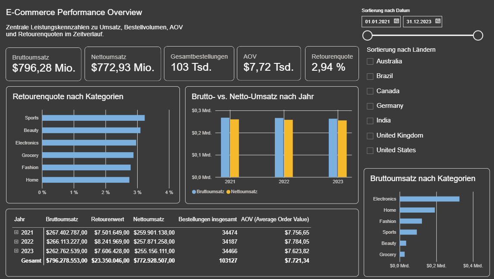
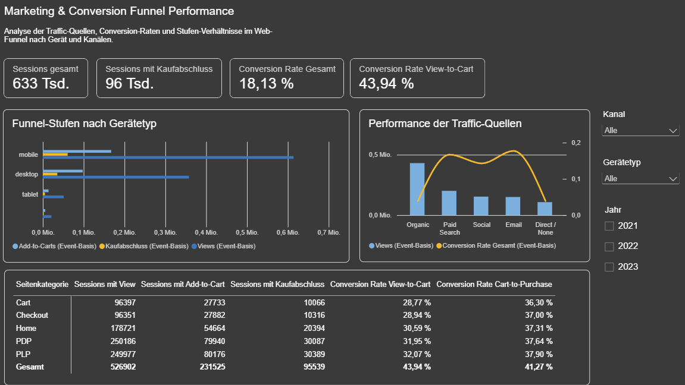
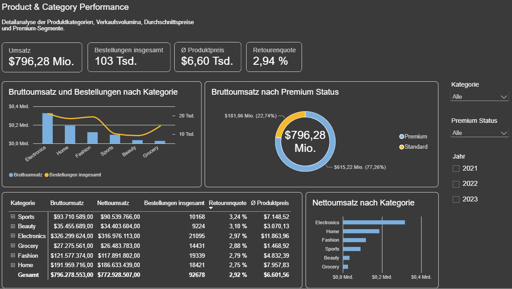
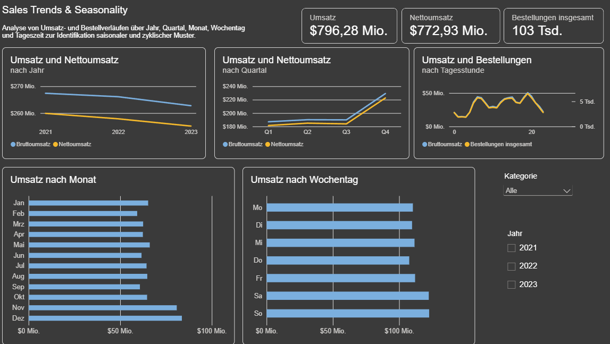

<div align="center">

# 📊 E-Commerce & Marketing Performance Dashboard

**Ein End-to-End Power BI Portfolio-Projekt zur Analyse von Marketing-Funnel, Kanal-Performance, Produkt- und Kundenverhalten.**


</div>

---

## 📑 Inhaltsverzeichnis

- [Über das Projekt](#-über-das-projekt)
- [Bewusst ausgeschlossene Kennzahlen & Analysebereiche](#️-bewusst-ausgeschlossene-kennzahlen--analysebereiche)
- [Datenquelle](#-datenquelle)
- [Tech Stack](#️-tech-stack)
- [Data Cleaning & ETL](#-data-cleaning-quality-assurance--etl)
- [Datenmodell](#-datenmodell-multi-fact-star-schema)
- [Finanz- & Bestell-Kennzahlen](#-finanz--bestell-kennzahlen)
- [Produkt- & Kategorie-Kennzahlen](#-produkt--kategorie-kennzahlen)
- [Analyseumfang & Leitfragen](#-analyseumfang--leitfragen)
- [Dashboard-Vorschau](#️-dashboard-vorschau)
- [Key Findings](#-key-findings)

---

## 🎯 Über das Projekt

Dieses Portfolio-Projekt bietet eine ganzheitliche Analyse der E-Commerce- und Marketing-Performance eines synthetischen Datensatzes. Der Fokus liegt auf einer methodisch sauberen Herangehensweise: Datenqualitätsprobleme wurden nicht nur erkannt, sondern systematisch untersucht, wo es möglich war behoben, und wo es nicht möglich war transparent im Analyseumfang berücksichtigt.

Der Bericht deckt folgende Themenfelder ab:

- 🔄 **Web Traffic & Conversion Funnel** – Nutzerreise von `view` über `add_to_cart` bis `purchase` *(Event-Ebene, siehe Einschränkungen)*
- 📡 **Channel Performance** – Conversion Rate und Event-Volumen nach `traffic_source` *(Event-Ebene, siehe Einschränkungen)*
- 🛍️ **Product & Category Performance** – Umsatz, Menge und Retourenquote nach Kategorie, Marke und Premium-Status
- 📅 **Zeitliche Muster** – Saisonale, wochentägliche und tageszeitliche Verkaufsmuster
- 💰 **High-Level Financials** – Brutto-/Netto-Umsätze, Erstattungen, Retourenquoten


## ⚠️ Bewusst ausgeschlossene Kennzahlen & Analysebereiche

> **ROAS** (Return on Ad Spend) und **CPA** (Cost per Acquisition) sind **nicht** Teil dieses Berichts, da der Datensatz keine Kosten-/Budgetspalte auf Kampagnenebene enthält. Eine Berechnung ohne belastbare Kostenbasis wäre nicht valide.
>
> **A/B-Test-Auswertung** wird **komplett aus dem Analyseumfang entfernt** – die Grunddaten erlauben keine belastbare Testgruppen-Zuordnung (siehe [Anomalien](#-data-cleaning-quality-assurance--etl)).
>
> **Zeitbasierte Kampagnen-Attribution** (First-/Last-Touch) sowie **session-basierte Funnel-/Kanal-Analysen** werden ebenfalls ausgeschlossen bzw. auf Event-Ebene umgestellt – Details siehe [Data Cleaning](#-data-cleaning-quality-assurance--etl).
>
> **Kundenverhalten** (Loyalty-Tier, Akquisitionskanal) und **aggregierte Kampagnen-Analyse** sind bewusst nicht Teil dieses Berichts – der Projektumfang wurde zugunsten eines fokussierten, tiefgehenden Showcases (Datenqualität, Modellierung, Storytelling) bewusst schlank gehalten, statt jedes denkbare Themenfeld oberflächlich abzudecken.

## 📂 Datenquelle

[Marketing & E-Commerce Analytics Dataset](https://www.kaggle.com/datasets/geethasagarbonthu/marketing-and-e-commerce-analytics-dataset) (Kaggle, synthetisch) – 5 Tabellen: `campaigns`, `customers`, `events`, `products`, `transactions`. Alle Beträge im Datensatz sind in **USD ($)** angegeben.

## 🛠️ Tech Stack

| Bereich | Tool |
|---|---|
| Datenexploration & Anomalie-Verifikation | Power Query (M) / DAX |
| ETL & Datenbereinigung | Power Query (M) |
| Datenmodellierung & Kennzahlen | Power BI / DAX |
| Visualisierung & Storytelling | Power BI Desktop |

---

## 🧹 Data Cleaning, Quality Assurance & ETL

Vor der Modellierung wurden die Rohdaten im **Power Query Editor** aufbereitet und auf Datenqualität, Formatierung sowie logische Konsistenz geprüft.

### 1. Allgemeine Transformationen & Standardisierung

- **Schlüsselspalten als Text:** Alle ID-Felder (`customer_id`, `campaign_id`, `product_id`, `transaction_id`, `session_id`) wurden in **`Text`** umgewandelt, um unbewusste Aggregationen zu verhindern und valide Joins sicherzustellen.
- **Textbereinigung:** **Kürzen** (*Trim*) und **Bereinigen** (*Clean*) auf alle Freitextspalten; fehlerhafte `product_id`-Strings wurden auf `"Unknown"` normiert.
- **Kanal-Vereinheitlichung:** Inkonsistente Groß-/Kleinschreibung in `events[traffic_source]` (`PAID SEARCH` vs. `Paid Search`) über **Jedes Wort groß schreiben** vereinheitlicht; `"Direct"` an `"Direct / None"` aus `campaigns` angeglichen.
- **Typisierung & Gebietsschema:** Datumsfelder über Gebietsschema **`Deutsch (Deutschland)`** (`TT.MM.JJJJ`) verankert; `is_premium` zu **Boolean** konvertiert; `refund_flag` bewusst als **Ganzzahl (0/1)** belassen (performante DAX-Summation).
- **Währung:** Alle monetären Felder (`base_price`, `gross_revenue`) als **USD ($)** formatiert, entsprechend der im Datensatz verwendeten Originalwährung.

### 2. Tabellenspezifische Logik & ID-Rekonstruktion

- **`campaigns`:** Dummy-Zeile (`campaign_id = "0"`, `channel = "Direct / None"`) per `Table.InsertRows`, um verwaiste Traffic-/Umsatzdaten ohne Kampagnenbezug aufzufangen.
- **`customers`:** ISO-2 Ländercodes (`DE`, `US`, `BR` ...) über bedingte Spalte in Vollnamen übersetzt, für präzise Geokodierung in Power BI Maps.
- **`transactions`:** Negativwerte bei Retouren (`refund_flag = 1`) via `Number.Abs()` in einer zusätzlichen Spalte `gross_revenue_abs` normiert (Original-Spalte `gross_revenue` bleibt mit Vorzeichen erhalten). Alle Finanz-Measures basieren einheitlich auf `gross_revenue_abs`.
- **`transactions[Date]`:** Zusätzliche reine Datumsspalte (dupliziert aus `timestamp`, ohne Uhrzeit) für eine funktionierende Beziehung zu `Dim_Date` – siehe Hinweis unten.
- **`product_id`-Skalierung:** siehe Anomalie-Abschnitt unten.

### 3. Dynamische Kalendertabelle (`Dim_Date`)

```dax
Dim_Date =
CALENDAR(
    MIN({MINX(transactions, transactions[timestamp]), MINX(events, events[timestamp]),
         MINX(customers, customers[signup_date]), MINX(campaigns, campaigns[start_date])}),
    MAX({MAXX(transactions, transactions[timestamp]), MAXX(events, events[timestamp]),
         MAXX(campaigns, campaigns[end_date])})
)
```

Deckt **alle** relevanten Datumsfelder ab, damit z. B. Signups oder Web-Views vor der ersten Transaktion lückenlos abgebildet werden.

| Attribut | Formel |
|---|---|
| `Year` | `YEAR([Date])` |
| `Month No` / `Month Name` | `MONTH([Date])` / `FORMAT([Date], "MMM")` |
| `Quarter` | `"Q" & QUARTER([Date])` |
| `Day of Week` | `WEEKDAY([Date], 2)` *(Montag = 1)* |
| `Day Name` | `FORMAT([Date], "DDD")` |

Als offizielle Datumstabelle markiert (*Mark as Date Table*); `Month Name` nach `Month No`, `Day Name` nach `Day of Week` sortiert.

> **Hinweis – Beziehung zu `transactions`:** Ursprünglich war `Dim_Date` mit `transactions[timestamp]` (inkl. Uhrzeit) verknüpft, wodurch die Beziehung nicht griff und nahezu der gesamte Umsatz in einer leeren Monatskategorie landete. Behoben durch eine zusätzliche reine Datumsspalte `transactions[Date]` als Beziehungsschlüssel. Da `Dim_Date` zudem den vollen Zeitraum über alle Datumsfelder abdeckt (inkl. `campaigns[end_date]`), kann ein Datums-Slicer auf `Dim_Date`-Basis Zeiträume ganz ohne Transaktionsdaten anzeigen (z. B. das Ende einer Kampagnenlaufzeit); transaktionsbezogene Slicer nutzen daher `transactions[Date]` direkt.

### 4. Plausibilitätsprüfungen & Dataset-Anomalien

#### ✅ Validierte Checks

| Check | Ergebnis |
|---|---|
| Primärschlüssel-Eindeutigkeit (`customer_id`, `campaign_id`, `product_id`) | Keine Duplikate |
| Faktentabellen-Integrität (`transaction_id`, `event_id`) | Keine exakten Zeilenduplikate |
| Null-Handling (`gross_revenue`, Datumsfelder) | Geprüft, keine unerwarteten Nullwerte |
| Alter (`age`) | 18 ≤ Alter ≤ 100 – ohne Befund |
| Mengen (`quantity`) | Keine Werte ≤ 0 bei regulären Käufen |
| Kampagnenzeiten | `start_date` stets vor `end_date` |

#### 🛠️ Gelöst: `product_id`-Skalierungsfehler

| | Vorher | Nach Korrektur (÷10) |
|---|---|---|
| Mismatch-Quote `transactions` | 91,1 % | **10,1 %** |
| Mismatch-Quote `events` | 91,0 % | **10,0 %** |

Durch systematisches Testen mathematischer Hypothesen (Modulo, Offset, Division) wurde ein Skalierungsfaktor **10** identifiziert (`products`: ID-Bereich 1–2.000; Faktentabellen: 10–20.000). Nach Integer-Division durch 10 entsprechen **100 % der verbleibenden Abweichungen** (10.449/10.449) exakt den bereits bekannten `"Unknown"`-Werten – keine unerklärte Restanomalie. Produkt-, Marken- und Kategorie-Analysen sind damit valide.

> **Zusatzverifikation:** Die verbleibenden 10.449 `"Unknown"`-Transaktionen tragen **$0 Umsatz** bei (`SUM(gross_revenue_abs)` bei `product_id = "Unknown"` = 0). Das bestätigt sich auch dashboard-seitig: Die Summe der Gross-Revenue-Werte aller sechs validen Kategorien ($796,28 Mio.) entspricht exakt der Gesamtsumme über alle 103.127 Transaktionen – ein weiterer Beleg für die Konsistenz der Korrektur.

#### 🚫 Zentrale Anomalie: Fehlende Konsistenz von Event-Attributen pro Session

Die schwerwiegendste Einschränkung dieses Datensatzes betrifft die Tabelle `events`: Mehrere kategoriale Attribute wurden offenbar **unabhängig pro einzelnem Event** zugewiesen, statt konsistent für eine gesamte `session_id` zu gelten. Ein Nutzer "wechselt" in den Rohdaten demnach mitten in einer Session scheinbar Gerät, Trafficquelle oder A/B-Testgruppe – was inhaltlich nicht plausibel ist.

| Attribut | Sessions mit Mehrfachwerten | Anteil (Basis: 633.000 Sessions) |
|---|---|---|
| `device_type` | 406.000 | **64,1 %** |
| `traffic_source` | 480.000 | **75,8 %** |
| `experiment_group` | 411.000 | **64,9 %** |

Ergänzend zeigt ein Abgleich der Event-Reihenfolge: **107.000 Sessions (16,9 %)** haben keinen `view`-Event, davon **20.223 Sessions** dennoch einen `add_to_cart`- oder `purchase`-Event (überschnitten in nur 7.000 Fällen) – u. a. **13.223 Sessions mit `purchase` ganz ohne vorherigen `view` oder `add_to_cart`**.

**Konsequenzen für den Analyseumfang:**

| Betroffener Bereich | Handling |
|---|---|
| Funnel-Conversion (View → Cart → Purchase) | Berechnung als **Verhältniszahl der Event-Anzahl pro Stufe**, nicht als sequenzielle Session-Journey |
| Channel Performance (`traffic_source`) | Berechnung auf **Event-Ebene** (Views/Add-to-Carts/Purchases je Kanal), nicht als eindeutige Session-Zählung |
| Geräte-Aufschlüsselung (`device_type`) | Ebenfalls auf **Event-Ebene**; eine Session-Conversion-Rate „pro Gerät" ist nicht sinnvoll berechenbar |
| A/B-Test-Auswertung (`experiment_group`) | **Vollständig aus dem Analyseumfang entfernt** – anders als bei Gerät/Kanal existiert hier keine sinnvolle Event-Ebene-Alternative, da A/B-Tests eine konsistente Gruppenzuordnung pro Nutzer/Session zwingend voraussetzen |

`page_category` ist von dieser Anomalie **nicht** betroffen – dass eine Session mehrere Seitentypen durchläuft (Home → PLP → PDP → Cart), ist normales, erwartetes Verhalten und keine Dateninkonsistenz.

> **Umsetzungshinweis:** Die zugrundeliegenden Measures (`Views nach Traffic Source`, `Add-to-Carts nach Traffic Source`, `Purchases nach Traffic Source`) enthalten trotz ihres Namens **keinen festen Bezug** auf `traffic_source` – sie zählen Events rein nach `event_type`, gefiltert durch den jeweiligen Visualisierungskontext (Filterkontext-Prinzip in DAX). Dadurch liefern sie unverändert korrekte Ergebnisse, wenn sie stattdessen mit `device_type` kombiniert werden (z. B. im Funnel-Diagramm „Funnel-Stufen nach Gerätetyp").

#### ⚠️ Nicht behebbar: Kampagnen-Zeitlogik

Ein Zeitstempel-Abgleich zwischen `events[timestamp]` und `campaigns[start_date]` ergab: Von 999.749 Events mit Kampagnenbezug (`campaign_id ≠ "0"`) liegen **501.187 (50,1 %)** zeitlich *vor* dem offiziellen Kampagnenstart.

**Konsequenz:** Zeitbasierte Attribution (First-/Last-Touch) wird ausgeschlossen. `campaign_id` bleibt für aggregierte, nicht-zeitkritische Analysen nutzbar (z. B. „Umsatz assoziiert mit Kampagne X"), nicht für kausale Aussagen („Kampagne X führte zu Y Käufen").

#### ⚠️ Nicht behebbar: Signup-Date-Anomalie

Ein Abgleich von `customers[signup_date]` mit dem jeweils frühesten `transactions[timestamp]` pro Kunde zeigt, dass bei **36.937 von 64.035 Kunden mit mindestens einer Transaktion (57,7 %)** das Signup-Datum *nach* dem ersten Kauf liegt.

**Konsequenz:** Kohortenbasierte bzw. zeitbasierte Kundenanalysen (z. B. „Umsatz X Tage nach Signup") werden ausgeschlossen. Analysen ohne Bezug zwischen `signup_date` und Kaufzeitpunkt (z. B. Neuanmeldungen pro Monat, Kundenverteilung nach `loyalty_tier`/Land) bleiben valide.

> **Übergreifende Beobachtung:** Mit `campaign_id`-Timing, `signup_date` sowie den drei Event-Attributen zeigen inzwischen **fünf unabhängige Prüfungen** dasselbe Muster: Zeitstempel und kategoriale Attribute wurden im Generierungsprozess dieses synthetischen Datensatzes offenbar unabhängig voneinander je Zeile gewürfelt, nicht konsistent pro Entität (Session/Kunde) vergeben. Dies wird als durchgängige, dokumentierte Eigenschaft des Datensatzes behandelt statt als isolierte Einzelfälle.

---

## 📐 Datenmodell (Multi-Fact Star Schema)

```
campaigns (1) ──┬──< events (n, campaign_id)
                └──< transactions (n, campaign_id)

customers (1) ──┬──< events (n, customer_id)
                └──< transactions (n, customer_id)

products (1) ───┬──< events (n, product_id_korrigiert)
                └──< transactions (n, product_id_korrigiert)

Dim_Date (1) ───┬──< events (n, Date)
                └──< transactions (n, Date)
```

- **2 Faktentabellen:** `transactions`, `events`
- **4 Dimensionstabellen:** `customers`, `campaigns`, `products`, `Dim_Date`
- **Beziehungen:** strikt 1:n, einseitige Filterrichtung (Dimension → Faktentabelle)

---

## 💵 Finanz- & Bestell-Kennzahlen

| Measure | Formel (Kern) | Ergebnis (Gesamt) |
|---|---|---|
| Gross Revenue | `SUM(gross_revenue_abs)` | $796,28 Mio. |
| Refund Amount | `SUM(gross_revenue_abs)` bei `refund_flag = 1` | $23,35 Mio. |
| Net Revenue | Gross Revenue − Refund Amount | $772,93 Mio. |
| Refund Rate | Anteil Transaktionen mit `refund_flag = 1` | 2,94 % |
| Total Orders | `COUNTROWS(transactions)` | 103.127 |
| AOV | Gross Revenue / Total Orders | $7.721,3 |
| AOV (netto, ohne Refunds) | Nur `refund_flag = 0` | $7.721,7 |

> **Hinweis zum AOV:** Der vergleichsweise hohe durchschnittliche Bestellwert (≈ $7.720) resultiert aus dem simulierten Produktsortiment mit einem Durchschnittspreis von ca. $6.600 (Preisspanne: $70–$46.458 laut `products[base_price]`) – typisch für Premium-/Elektronikgüter, nicht für einen Alltagsprodukte-Shop.

**Umsatzentwicklung nach Jahr:**

| Jahr | Gross Revenue | Net Revenue | Total Orders |
|---|---|---|---|
| 2021 | $267,40 Mio. | $259,90 Mio. | 34.474 |
| 2022 | $266,11 Mio. | $257,87 Mio. | 34.187 |
| 2023 | $262,76 Mio. | $255,16 Mio. | 34.466 |

Ein leichter, stetiger Umsatzrückgang bei nahezu stabilem Bestellvolumen über die drei Jahre – ein Kandidat für die vertiefende Analyse (z. B. Zusammenhang mit AOV-Entwicklung oder Produktmix).

---

## 🛍️ Produkt- & Kategorie-Kennzahlen

| Kategorie | Gross Revenue | Net Revenue | Total Orders | Refund Rate | Ø Produktpreis |
|---|---|---|---|---|---|
| Electronics | $326,30 Mio. | $316,98 Mio. | 21.095 | 2,97 % | $11.863,96 |
| Home | $191,96 Mio. | $186,63 Mio. | 18.421 | 2,75 % | $7.957,83 |
| Fashion | $121,58 Mio. | $117,89 Mio. | 19.339 | 2,79 % | $4.832,39 |
| Sports | $93,71 Mio. | $90,54 Mio. | 10.168 | 3,24 % | $7.148,52 |
| Beauty | $35,46 Mio. | $34,40 Mio. | 9.224 | 3,10 % | $3.070,13 |
| Grocery | $27,28 Mio. | $26,48 Mio. | 14.431 | 2,88 % | $1.468,92 |
| **Gesamt (valide Kategorien)** | **$796,28 Mio.** | **$772,93 Mio.** | **92.678** | **2,92 %** | **$6.601,56** |

> **Hinweis:** Die Summe der `Total Orders` über die sechs Kategorien (92.678) liegt um exakt 10.449 unter der Gesamtzahl aller Transaktionen (103.127) – das entspricht genau der Anzahl der `"Unknown"`-Produkt-Fälle aus der Product-ID-Anomalie (siehe oben), die keiner Kategorie zugeordnet werden können und $0 Umsatz beitragen. Die Revenue-Summen stimmen dadurch unverändert mit den Gesamt-Kennzahlen überein.

**Premium- vs. Standard-Segment:**

| Segment | Gross Revenue | Anteil |
|---|---|---|
| Standard | $615,22 Mio. | 77,26 % |
| Premium | $181,06 Mio. | 22,74 % |

Refund-Raten bewegen sich über alle Kategorien hinweg in einer engen Spanne (2,75–3,24 %) – keine Kategorie sticht negativ heraus.

---

## 🔍 Analyseumfang & Leitfragen

| Bereich | Leitfrage | Datenbasis |
|---|---|---|
| Conversion Funnel | Wo brechen Nutzer ab (View → Cart → Purchase)? Unterschiede nach Seitentyp? *(Event-Ebene, siehe Anomalien)* | `events` |
| Channel Performance | Welcher `traffic_source`/`device_type` hat das höchste Event-Volumen bzw. die beste Conversion – nach Rate **und** Volumen? *(Event-Ebene)* | `events` |
| Produkt & Kategorie | Beste Kategorie/Marke? Höchste Refund-Rate vs. höchste absolute Refund-Zahl? | `transactions`, `products` |
| Zeitliche Muster | Saisonale/wochentägliche/tageszeitliche Muster im Kaufverhalten? | `transactions`, `Dim_Date` |

---

## 🖼️ Dashboard-Vorschau

**1. Executive Overview & Financials**


**2. Marketing & Conversion Funnel Performance**


**3. Product & Category Performance**


**4. Sales Trends & Seasonality**


---

## 💡 Key Findings

**Umsatz & Finanzen**
- Der Umsatz sinkt trotz nahezu stabilem Bestellvolumen leicht von $267,4 Mio. (2021) auf $262,8 Mio. (2023) – ein Rückgang von ca. 1,7 % bei gleichzeitig stabiler Refund Rate (~2,9–3,1 %), der näher untersucht werden könnte (z. B. Preisentwicklung, Produktmix).
- Der hohe durchschnittliche Bestellwert (AOV ≈ $7.720) ist keine Auffälligkeit, sondern Ausdruck eines Premium-/Elektronik-lastigen Produktsortiments (Ø Produktpreis ≈ $6.600, Spanne $70–$46.458).

**Conversion Funnel & Channels**
- Der Funnel zeigt eine Gesamt-Conversion von 18,13 % (View → Purchase); der größte absolute Abbruch liegt zwischen View und Add-to-Cart (295.000 verlorene Sessions), nicht im Checkout.
- Organic Traffic bringt mit 430.833 Views mehr als doppelt so viel Volumen wie jeder andere Kanal, weist aber mit nur 4 % die niedrigste Conversion Rate aller Kanäle auf. Email erzielt dagegen mit 18 % die höchste Rate – bei nur rund einem Drittel des Organic-Volumens (150.240 Views). Der volumenstärkste Kanal ist damit nicht automatisch der wertvollste; eine reine Traffic-Optimierung auf Organic würde die Qualitätslücke zu Email/Paid Search übersehen.
- Anders als in vielen E-Commerce-Kontexten üblich zeigt sich zwischen den Gerätetypen **kein** Conversion-Unterschied: Mobile (613.828 Views), Desktop (357.777 Views) und Tablet (51.013 Views) konvertieren mit jeweils ~10 % nahezu identisch. Mobile dominiert im Volumen, ohne dass dies mit einer schlechteren Nutzererfahrung einhergeht.

**Produkt & Kategorie**
- Electronics ist mit $326,3 Mio. (41 % des Gesamtumsatzes) die dominante Kategorie, gefolgt von Home ($192,0 Mio.) und Fashion ($121,6 Mio.).
- Die Refund Rate ist über alle Kategorien hinweg auffällig homogen (2,75–3,24 %) – kein Produktsegment sticht als Retouren-Problem heraus.
- Das Standard-Segment erwirtschaftet mit 77,3 % den Großteil des Umsatzes; Premium-Produkte tragen 22,7 % bei.

**Saisonalität & Zeitmuster**
- Q4 zeigt einen deutlichen Umsatzsprung gegenüber Q1–Q3 (von ~$185 Mio. auf ~$240 Mio.) – konsistent mit dem Dezember als umsatzstärkstem Einzelmonat, passend zum saisonalen Jahresend-/Feiertagsgeschäft.
- Umsätze sind am Wochenende (Sa/So) deutlich höher als an Werktagen – bei einem Premium-Sortiment ein plausibles Muster, da größere Kaufentscheidungen eher in der Freizeit getroffen werden.
- Auf Tagesebene liegt der Umsatz-Peak zwischen 19 und 22 Uhr, mit dem Tiefpunkt in den frühen Morgenstunden (1–4 Uhr) – ein klassisches Feierabend-Kaufmuster.

**Datenqualität (methodischer Beitrag)**
- Ein vermeintliches 91 %-Datenproblem bei Produkt-IDs konnte durch systematisches Hypothesentesten auf einen einzelnen Skalierungsfaktor (÷10) zurückgeführt und vollständig korrigiert werden.
- Drei unabhängige Event-Attribute (Gerät, Trafficquelle, A/B-Testgruppe) zeigen dieselbe strukturelle Inkonsistenz (mehrere Werte pro Session) – konsequent dokumentiert und in der Analyse-Methodik berücksichtigt, statt unkommentiert übernommen zu werden.


